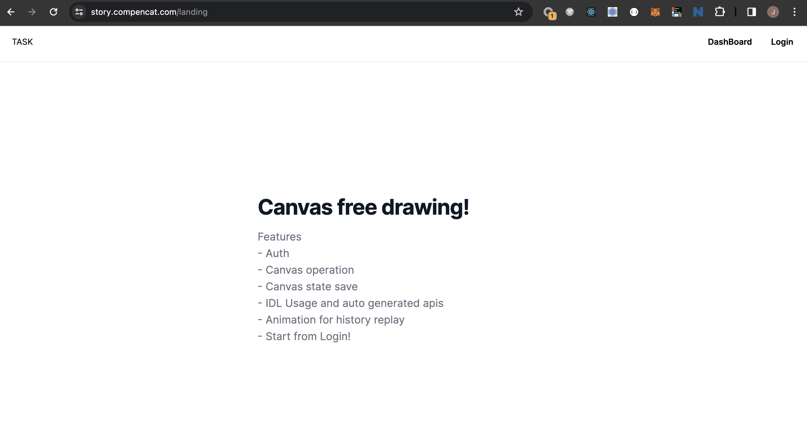
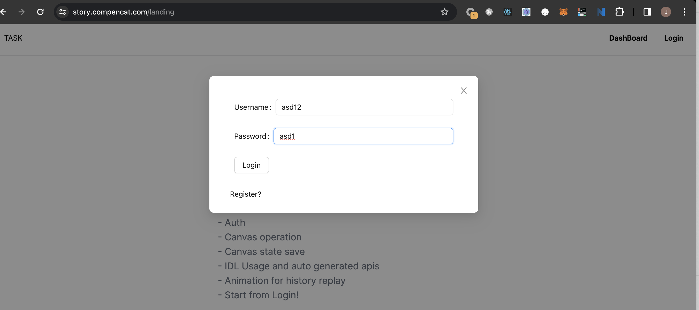
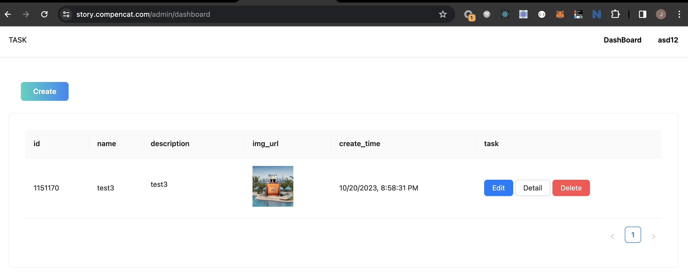
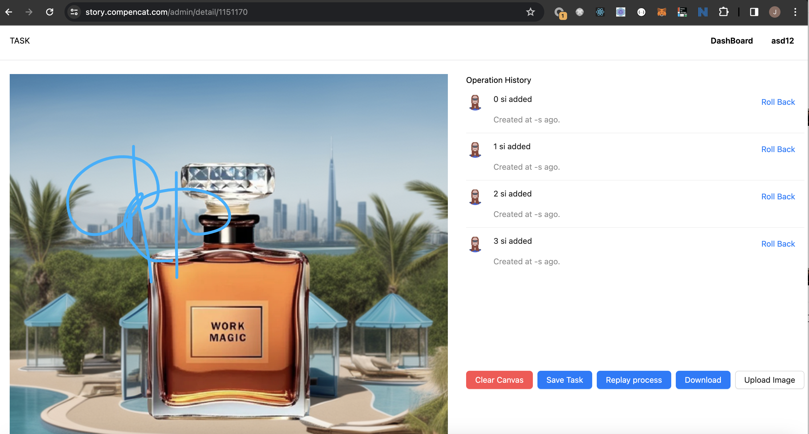

# Report

## Architecture

This is a Monorepo based pnpm. Includes this tech stacks:
- Backend: GoLang
- API Interface: IDL(IDL based auto generated code)
- DB: MySQL
- Frontend: Next, React, TailwindCSS
- Deploy: Docker, Docker-compose
- Third Parties: COS object storage(for uploading image)
- Route and Port Combine: Nginx

## Pages

#### Landing Page

#### Login Component

You can actually register and login.

This project is using JWT as the auth middleware.

#### Task List Page

You can create, edit and delete a certen task.

#### Task Detail Page

As this pic, we can draw on the picture on the left. And every steps will record on the right. You can roll back to any previous step that you want.

And also, you can

- Download the current pic and upload a new image.
- Replay the animation of the creation of all records.
- Clear canvas.
- Save all steps to database.

